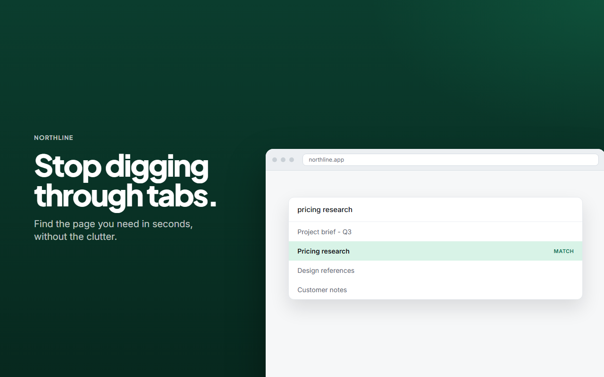
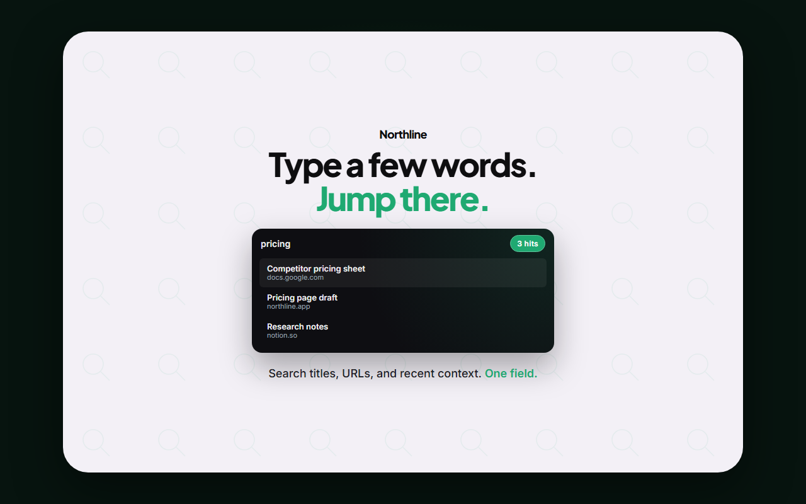
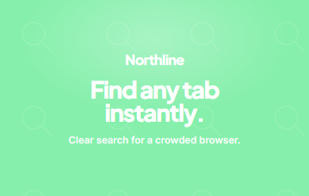
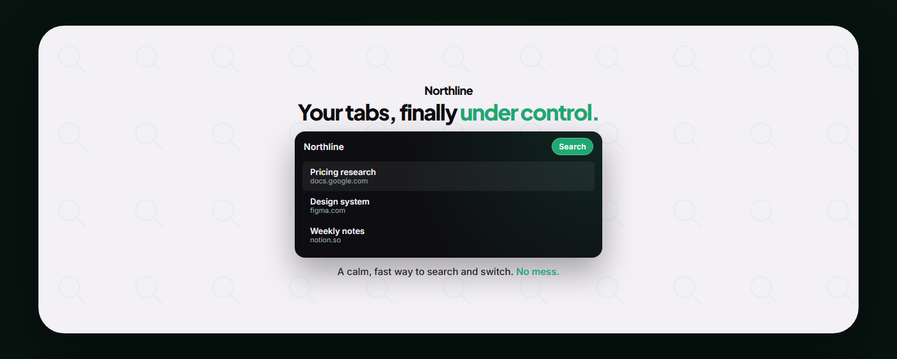

<p align="center">
  
</p>

<p align="center">
  <strong>Write HTML. Render store creatives.</strong><br />
  Built for agents.
</p>

<p align="center">
  <a href="#quick-start">Quickstart</a> ·
  <a href="#skills">Skills</a> ·
  <a href="#cli">CLI</a> ·
  <a href="#examples">Examples</a>
</p>

html-marketing turns HTML into pixel-exact App Store, Play Store, Chrome Web Store, and social images, plus short MP4s. Author on a fixed canvas. Preview in the browser. Export locally with Playwright and FFmpeg.

Same production loop as [Hyperframes](https://github.com/heygen-com/hyperframes): plan, write valid HTML, lint, preview, render. Sizes and Phosphor icons are looked up, not invented. No PowerShell. macOS, Linux, and Windows.

## Quick start

### With an AI coding agent

```bash
npx html-marketing skills update
npx skills add nicholasxdavis/html-marketing --full-depth
```

`/html-marketing` is the router. It installs each creation workflow on demand.

```bash
npx html-marketing skills update store-listing
```

> Using `/html-marketing`, create a Chrome Web Store screenshot set for a local tab search extension. Style Atlas. Five beats: hook, mechanism, differentiator, benefit, trust.

### Manually with the CLI

```bash
npm install -g html-marketing
npx playwright install chromium
npx html-marketing init my-listing --non-interactive
cd my-listing
npx html-marketing preview
npx html-marketing render
```

**Requirements:** Node.js 22+, FFmpeg (for video)

## Skills

Read `/html-marketing` first.

| Skill | Use when |
|-------|----------|
| `/html-marketing` | Any request to make, edit, or render marketing creatives |
| `/store-listing` | 5-frame screenshot set for Chrome, App Store, or Play |
| `/promo-graphics` | Promo tile, marquee, Play feature graphic |
| `/social-post` | Instagram, Facebook, Reddit, X, YouTube thumb, PFP, OG |
| `/motion-sting` | Short unnarrated MP4, typically under 10s |
| `/product-launch-set` | Full campaign from a brief or URL |

Domain skills (installed with core): `/html-marketing-core`, `-creative`, `-device`, `-prompts`, `-cli`.

## CLI

```bash
npx html-marketing doctor
npx html-marketing sizes youtube
npx html-marketing specs icons
npx html-marketing lint
npx html-marketing check
npx html-marketing preview
npx html-marketing render
npx html-marketing render path.html -o out.png --preset cws-screenshot
npx html-marketing video path.html -o out.mp4 --duration 4 --fps 30
npx html-marketing prompts atlas
npx html-marketing skills update store-listing
```

`render` with no file reads `manifest.yaml`.

## Examples

Demo campaign (Northline). Field + Caption + Device. Atlas field. Harbor split.

<p>
  
</p>

<p>
  
</p>

<p>
  
  &nbsp;
  
</p>


## Authoring rules

1. Look up the size. `npx html-marketing sizes <platform-or-id>`.
2. Paste one prompt from `prompts/`. Do not invent a look.
3. `body` and `.canvas` match the preset. Field + Caption + Device.
4. Phosphor Regular for icons. No emoji. No em dashes.
5. Video implements `window.__hm.seek(t)`.
6. `lint` and `check` must pass before `render`.

## License

MIT.
