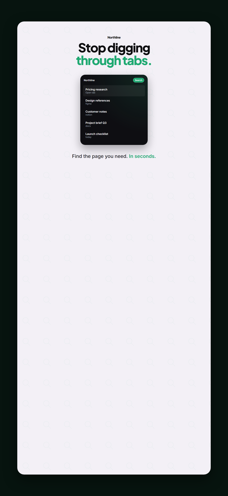

<p align="center">
  
</p>

<p align="center">
  <strong>Write HTML. Render store creatives.</strong><br />
  Built for agents.
</p>

<p align="center">
  <a href="#quick-start">Quickstart</a> ·
  <a href="#skills">Skills</a> ·
  <a href="#cli">CLI</a> ·
  <a href="#examples">Examples</a>
</p>

html-marketing turns HTML, CSS, and a short seekable timeline into pixel-exact App Store, Play Store, Chrome Web Store, and social images, plus short MP4s. Author on a fixed canvas. Preview in the browser. Export locally with Playwright and FFmpeg.

Sizes, copy rules, and Phosphor icon usage are locked in `data/sizes.json` and `specs/` so agents do not invent them.

Same production loop as a serious agent video stack: plan, write valid HTML, lint, preview, render. No PowerShell. Works on macOS, Linux, and Windows.

## Quick start

### With an AI coding agent

Install the skills, then describe the listing you want:

```bash
npx html-marketing skills update
npx skills add . --full-depth
```

The core set is all you need. `/html-marketing` is the router. It installs each creation workflow on demand. Agents and non-interactive runs should use `npx html-marketing skills update` instead of a bare interactive picker.

After you publish the repo:

```bash
npx skills add <owner>/html-marketing --full-depth
```

Keep `--full-depth` so the clone matches `main`, not a stale registry blob.

Try a prompt like:

> Using `/html-marketing`, create a Chrome Web Store screenshot set for a local tab search extension. Style Atlas. Five beats: hook, mechanism, differentiator, benefit, trust.

The skills teach the loop: confirm the brief, pick a style prompt, write valid HTML, wire seekable motion if needed, lint, preview, and render.

### Manually with the CLI

```bash
npm install
npx playwright install chromium
npx html-marketing init my-listing --non-interactive
cd my-listing
npx html-marketing preview
npx html-marketing render
```

**Requirements:** Node.js 22+, FFmpeg (for video)

Optional POSIX helper:

```bash
sh scripts/setup.sh
```

## Skills

Read `/html-marketing` first. It is the router and capability map.

### Router

| Skill | Use when |
|-------|----------|
| `/html-marketing` | Any request to make, edit, or render store creatives or a marketing sting |

### Creation workflows

| Skill | Use when |
|-------|----------|
| `/store-listing` | A 5-frame screenshot set for Chrome, App Store, or Play |
| `/promo-graphics` | Promo tile 440x280, marquee 1400x560, Play feature 1024x500 |
| `/social-post` | Instagram, Facebook, Reddit, X, YouTube thumb, PFP, OG card |
| `/motion-sting` | Short unnarrated motion, typically under 10s, MP4 |
| `/product-launch-set` | Full campaign from a brief or URL |

### Domain skills

| Skill | Covers |
|-------|--------|
| `/html-marketing-core` | Canvas contract, manifest, seek API, determinism |
| `/html-marketing-creative` | DESIGN.md, copy beats, two-second test |
| `/html-marketing-sizes` | Exact presets. Never guess pixels |
| `/html-marketing-icons` | Phosphor Regular only |
| `/html-marketing-device` | Phone and browser frames, locked layouts |
| `/html-marketing-prompts` | Atlas, Harbor, Meridian, Clay, Ledger recipes |
| `/html-marketing-cli` | init, lint, check, preview, render, doctor |

Install the core set from anywhere:

```bash
npx html-marketing skills update
```

Install one workflow:

```bash
npx html-marketing skills update store-listing
```

## CLI

```bash
npx html-marketing doctor
npx html-marketing sizes
npx html-marketing sizes youtube
npx html-marketing sizes --kind pfp
npx html-marketing specs
npx html-marketing specs icons
npx html-marketing lint
npx html-marketing check
npx html-marketing preview
npx html-marketing render
npx html-marketing render path.html -o out.png --preset cws-screenshot
npx html-marketing video path.html -o out.mp4 --duration 4 --fps 30
npx html-marketing prompts atlas
```

`render` with no file reads `manifest.yaml` in the current project.

## Examples

Demo campaign (Northline). Field + Caption + Device. Atlas field. Harbor split.

<p>
  
</p>

<p>
  
</p>

<p>
  
  &nbsp;
  
</p>

Portrait iPhone 6.9 class (1320x2868):

<p>
  
</p>

Rebuild them:

```bash
npx html-marketing render --output output/demo-extension
```

## Authoring rules

1. Look up the size. `npx html-marketing sizes <platform-or-id>`. Do not invent pixels.
2. Open a prompt from `prompts/` before touching HTML.
3. Fixed canvas. `body` and `.canvas` match the preset.
4. Every frame is Field + Caption + Device. Lock geometry across the set.
5. Phosphor Regular for icons. No other packs. No emoji.
6. No emojis. No em dashes.
7. For video, implement `window.__hm.seek(t)`.

## Project layout

```text
html-marketing/
  DESIGN.md
  AGENTS.md
  specs/                  Design specs (platforms, copy, icons)
  skills/                 Agent skills
  prompts/                Style recipes
  templates/              Shared CSS and starters
  projects/demo-extension
  cli/                    Node CLI
  data/sizes.json         Size catalog
```

## What you can build

- Chrome Web Store screenshot sets, promo tiles, and marquees
- App Store iPhone 6.9 and iPad 13 listing frames
- Google Play phone screenshots and feature graphics
- YouTube thumbs, IG/FB/Reddit posts, X posts, PFPs, Open Graph cards
- Short product stings and logo hits
- Repeatable, agent-driven listing pipelines

## License

MIT. Vendor trees under `vendor/` keep their upstream licenses.
